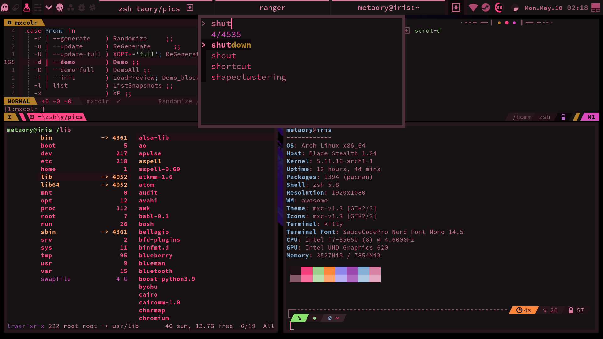

# mxcolr

#### :construction: NOT READY FOR PUBLIC USE :construction:
#### :rotating_light: DO NOT RUN WITHOUT READING THE SOURCE FIRST :rotating_light:

## usage
    mxcolr --init
    mxcolr --demo
    mxcolr --generate
    mxcolr --update

## demos
  

  ***
  
  #### generate
  
  ***
  #### update
  

## requirements
* [pastel](https://github.com/sharkdp/pastel)

## optional requirements
* [oomox](https://github.com/themix-project/oomox)
* [spicetify-cli](https://github.com/khanhas/spicetify-cli)
* [ffmpeg](https://github.com/FFmpeg/FFmpeg)

## currently supporting
* Xresource scheme
* Kitty terminal
* ~~Alacritty terminal~~
* Vim colorscheme
* Vim Airline theme
* Vim LeaderF theme
* Vim LeaderGuide theme
* Vimium (chromium extension)
* FZF
* Spotify
* Slack
* Ranger
* P10k
* GTK Theme
* GTK Icon Theme
* Wallpaper tint
* Tmux
* AwesomeWM
