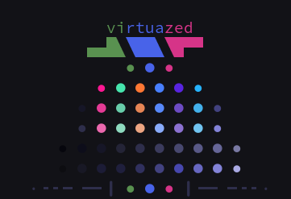

# mxcolr :construction:

  

usage
=====
    mxcolr --init
    mxcolr --generate <strategy>
    mxcolr --demo
    mxcolr --update

flags
=====
    -i, --init                | initial bootstrap
    -g, --generate <strategy> | <vivid, lch> (Pastel randomization strategy) default is lch
    -u, --update              | apply to all plugins
    -U, --update-force        | force apply to all plugins without any prompts
    -d, --demo                | basic demo
    -D, --demo-all            | complete demo
    -l, --list                | list all saved snapshots
    -s, --save                | save snapshot
    --verbose                 | verbose logs

outputs
=======

mxseed
------
`mxseed` is a trio of randomely generated colors, it's the core of the palette
- `~/.config/mxc/mx-seed` sample generated [mx-seed](./assets/samples/mx-seed)
> the entire palette is drived from this generated `seed` file 

theme.mx
--------
`theme.mx` is the primary output scheme file
- `~/.config/mxc/theme.mx` sample generated [theme.mx](./assets/samples/theme.mx)
> given the same `seed` file, its almost! guaranteed the same `theme.mx` will be produced.

> _allowing post generation calibrations._

`theme.mx` is intended to be sourced in `.profile` or `bashrc` to have apps that can directly access system env read system scheme from it

  

Basic Usage
===========
Templates are the easiest way to produce scheme files for different apps, 

every file the `./templates/{tpl}` will be parsed, scheme variables replaced and placed in `~/.config/mxc/{tpl}`
possible variables in addition to [theme.mx](./assets/samples/theme.mx) are gui (hex) colors wihtout `#`
with prefix of `HL` eg: `HLC01` `HLWBG` > `df419b` `4863e9`

### some apps that ONLY rely on template file
- kitty  template:[kitty-theme.conf](./templates/kitty-theme.conf) output:[kitty-theme.conf](./assets/samples/kitty-theme.conf)
- xresources.sh, tmux.sh vim.sh could have too

Advance Usage
=============
if further steps required to patch an app a plugin `sh` file can be added to plugins forlder to make the additinal steps
plugin apply function will be called after parsing templates if there is any template

each `sh` file presents in `./plugins` folder is treated as a plugin and is sourced

its expected to follow these patterns:
* filename: `[0-9]-[a-z_].sh` _eg `1-vim.sh`_
  * prefix number is the `order` its loaded, 0 means disabled
  * suffix the `plugin_name`
* plugin file is expected to have a function named `apply_{plugin_name}`
  this function will be called with confirmation prompt

> current active loaded theme variables are available to plugin

> all templates if any are parsed before calling apply_ function

> plugins outputs will first be drafted in `/tmp/mxc` and later upon confirmation prompt moved to `~/.config/mxc/{plugin_name}` 
unless different destination is set

### some apps that rely on BOTH template file AND plugin file
- lscolors template:[lscolors-vivid.yml](./templates/lscolors-vivid.yml) output:[lscolors-vivid.yml](./samples/lscolors-vivid.yml) plugin:[2-lscolors.sh](./plugins/2-lscolors.sh)  output:[lscolors](./samples/lscolors)
- gtk.sh, spotify.sh could have too

### some apps that rely on ONLY plugin file
- vimium, gtk.sh, spotify.sh, awm.sh

***

update
------

snapshot list
-------------

  
***
  

***

Requirements
------------
- [pastel](https://github.com/sharkdp/pastel)

Optional Requirements
---------------------
- [tmux](https://github.com/tmux/tmux)
- [oomox](https://github.com/themix-project/oomox)
- [spicetify-cli](https://github.com/khanhas/spicetify-cli)
- [ffmpeg](https://github.com/FFmpeg/FFmpeg)
- [vivid](https://github.com/sharkdp/vivid)

Plugins
-------
- Xresources
- Kitty
- Vim colorscheme
- Vimium
- FZF
- Spotify
- Slack
- Ranger
- P10k
- GTK Theme
- GTK Icon Theme
- Wallpaper tint
- Tmux
- AwesomeWM
- LS_COLORS

***

  

