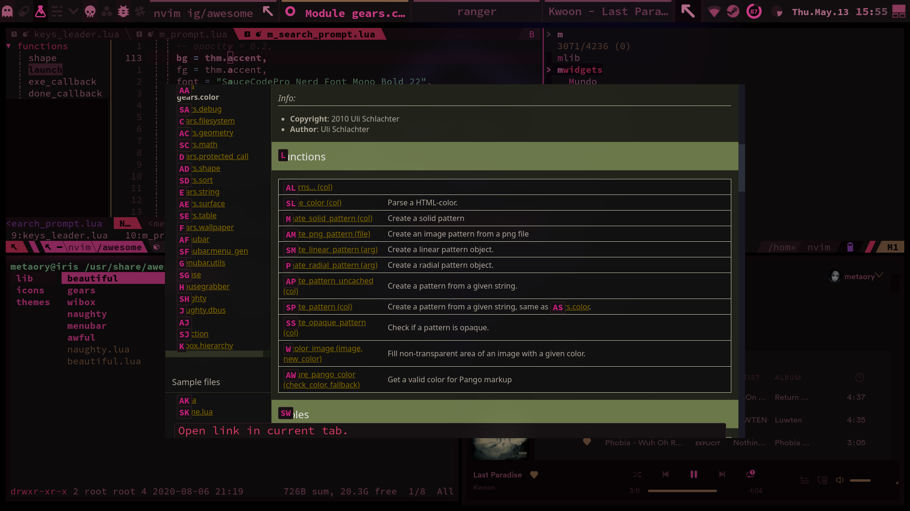
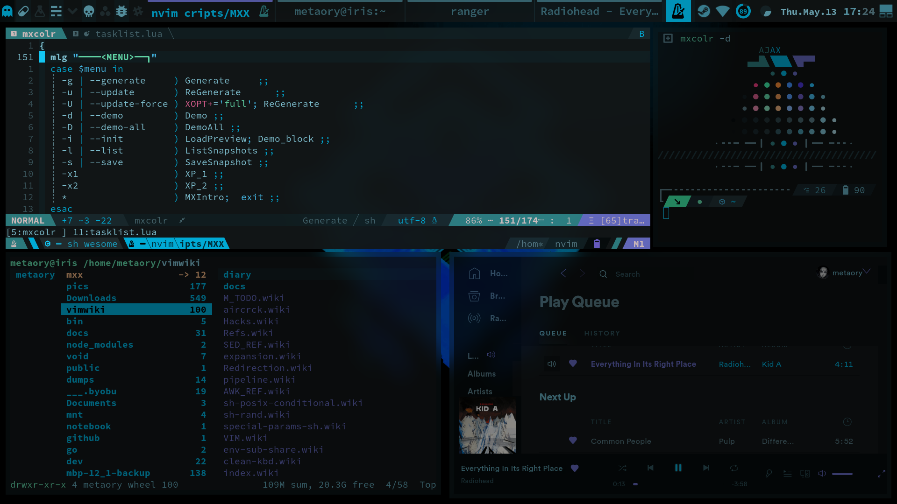

# mxcolr :construction:

  

usage
=====
    mxcolr --init
    mxcolr --generate <strategy>
    mxcolr --demo
    mxcolr --update

flags
=====
    -i, --init                | initial bootstrap
    -g, --generate <strategy> | <vivid, lch> (Pastel randomization strategy) default is lch
    -u, --update              | apply to all plugins
    -U, --update-force        | force apply to all plugins without any prompts
    -d, --demo                | basic demo
    -D, --demo-all            | complete demo
    -l, --list                | list all saved snapshots
    -s, --save                | save snapshot
    --verbose                 | verbose logs

outputs
=======
### `mxseed` is a trio of randomely generated colors, it's the core of the palette
- `$XDG_CONFIG_HOME/mxc/mx-seed`  [sample_generated_seed](./data/sample_mx-seed)
> the entire palette is drived from this generated `seed` file 

### `theme.mx` is the primary output scheme file
- `$XDG_CONFIG_HOME/mxc/theme.mx` [sample_generated_theme.mx](./data/sample_theme.mx)
> given the same `seed` file, its guaranteed the same `theme.mx` will be produced.
> _allowing for post generation calibrations._

### `theme.mx` is intended to be sourced in `.profile` or `bashrc` and have apps that can directly access system env read system scheme from it

#### other apps can have a plugin to make the necessarily changes,

### **Plugins Structure** [plugins-readme](./plugins)

***

lch strategy
------------

vivid strategy
--------------

update
------

snapshot list
-------------

  
***
  

***

Requirements
------------
- [pastel](https://github.com/sharkdp/pastel)

Optional Requirements
---------------------
- [tmux](https://github.com/tmux/tmux)
- [oomox](https://github.com/themix-project/oomox)
- [spicetify-cli](https://github.com/khanhas/spicetify-cli)
- [ffmpeg](https://github.com/FFmpeg/FFmpeg)

Plugins
-------
- Xresources
- Kitty
- ~~Alacritty~~
- Vim colorscheme
- Vim Airline theme
- Vim LeaderF theme
- Vim LeaderGuide theme
- Vimium
- FZF
- Spotify
- Slack
- Ranger
- P10k
- GTK Theme
- GTK Icon Theme
- Wallpaper tint
- Tmux
- AwesomeWM

