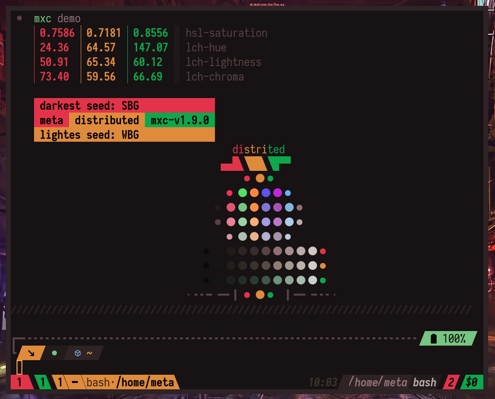

# mxcolr ▲

[](https://gitter.im/metaory/mxcolr?utm_source=badge&utm_medium=badge&utm_campaign=pr-badge&utm_content=badge)

<p align="center">
  
</p>

<p align="center">
  :warning: Warning! This is experimental! :warning:
</p>

<p align="center">
  
</p>

Usage
=====
    mxcolr [options] <action> [params]

Options
=======
    --force                 | forcefull update
    --verbose               | verbose logs
    --tmp-only              | exit silently after placing temp files in /tmp/mxc

Utilities
=========
    --gen-icon              | [char, path]; create image in path icon from the char
    --lorem                 | [length, char]; print char randomely for the length 
    --lorem-cols            | [char]; fill terminal column with char
    --darkest               | [colors]; return darkest color of the list
    --lightest              | [colors]; return lightest color of the list

Actions
=======
    -g, generate <strategy> | <vivid, lch> (Pastel randomization strategy) default is lch
    -u, update              | apply to all plugins
    -U, update-force        | force apply to all plugins without any prompts
    -d, demo                | basic demo
    -D, demo-all            | complete demo
    -l, list                | list all saved snapshots
    -r, random              | pick a random snapshot
    -s, save                | save snapshot
     *                      | intro

Motivations
===========
While tools like Oomox and Spicetify are great in reallity you probably got more than GTK theme and Icons you'd want to patch

Terminal colors, terminal prompt, window manager / status bar theme / icons, Vim/Atom/SourceCode editor and more 

Some apps might require to compile and build, all of these are just too repetitive and anoying to do for every change, then there is the never ending search for the right color scheme  

What about
----------
- [Pywal](https://github.com/dylanaraps/pywal): all about Wallpaper,, great documentation and support though. 
> almost all [pywal-customization](https://github.com/dylanaraps/pywal/wiki/customization) can be easilly added
- [Oomox](https://github.com/themix-project/oomox) plugins: possible,, to mxcolr, oomox is just another plugin for gtk theme and icon
 
#### This repo goal is to be a tool for generating and previewing palettes and serve as a framework for patching any application with few keystrokes.

## Not for the faint-hearted
Only tested on Arch Linux, not advised for beginner users.

### There is a lite version of this project at [mxcolr-lite](https://github.com/metaory/mxcolr-lite)
 
Outputs
=======

seed.mx
------
[seed.mx](./assets/samples/seed.mx) is a trio of randomely generated colors, it's the core of the palette
- `~/.config/mxc/seed.mx` sample generated [seed.mx](./assets/samples/seed.mx)
> the entire palette is drived from this generated `seed` file 

Given the same `seed` file, its guaranteed the same `scheme file` be produced.

Possible variables available in all templates or plugins are:
```bash
C00 C01 C02 C03 C04 C05 C06 C07 C08 C09 C10 C11 C12 C13 C14 C15
    CX1 CX2 CX3 CX4 CX5 CX6 # extra saturated
    CY1 CY2 CY3 CY4 CY5 CY6 # extra desaturated
    CF1 CF2 CF3 CF4 CF5 CF6 # fg color on CX bg

SBG WBG EBG # seed bg colors
SFG WFG EFG # seed fg colors

SK0 SK1 SK2 SK3 SK4 SK5 SK6 SK7 SK8 SK9 # S shades
WK0 WK1 WK2 WK3 WK4 WK5 WK6 WK7 WK8 WK9 # W shades
EK0 EK1 EK2 EK3 EK4 EK5 EK6 EK7 EK8 EK9 # E shades

XBG OBG # main bg colors 
XFG OFG # main fg colors
```

#### sample:
<p align="center">
  
</p>

#### Variants
- **gui** variant with their hex values
- **gui hashless** variant with their hex values without leading `#`; prefixed with `HL`
- **cterm** variant with their ansi-8bit values; prefixed with `T`

#### examples:
```bash
echo $C04 $WK6
#3b88df #6f7690

echo $HLC04 $HLWK6
3b88df 6f7690

echo $TC04 $TWK6
33 60
```


ENV Specifics
=============

Shell
-----
 [root.mx](./assets/samples/root.mx) is the primary output scheme sh file
- `~/.config/mxc/root.mx` sample generated [root.mx](./assets/samples/root.mx)

> intended to be sourced in `.profile` or `bashrc` and have apps that can directly access system env read system scheme from it

Lua scheme
----------

tpl: [mxc-nvim-colors.lua](./templates/mxc-nvim-colors.lua)
out: [mxc-nvim-colors.lua](./assets/samples/mxc-nvim-colors.lua)

Vim
---

output: [root-mx.vim](./assets/samples/root-mx.vim)
plugin: [2-vim.sh](./plugins/2-vim.sh)

> intented to be sourced in vimrc

css / less
----------
css / less for web/electron apps

**root-mx.css** tpl:[root-mx.css](./templates/root-mx.css) out:[root-mx.css](./assets/samples/root-mx.css)

**root-mx.less** tpl:[root-mx.less](./templates/root-mx.less) out:[root-mx.less](./assets/samples/root-mx.less)

> intented to be included in other js / electron apps, like Atom editor or Source Code

***

<p align="center">
  
</p>

Basic Usage
===========
Templates are the easiest way to produce scheme files for different apps, 
every file in `./templates/{tpl}` will be parsed; scheme variables replaced; and placed in `~/.config/mxc/{tpl}`

### some apps that ONLY rely on template file
- kitty  tpl:[kitty-theme.conf](./templates/kitty-theme.conf) out:[kitty-theme.conf](./assets/samples/kitty-theme.conf)
- xresources.sh, tmux.sh vim.sh could have too

Advance Usage
=============
if further steps required to patch an app a plugin `sh` file can be added to plugins folder to make the additinal steps

each `sh` file presents in `./plugins` folder is treated as a plugin and is sourced

its expected to follow these patterns:
* filename: `[0-9]-[a-z_].sh` _eg `1-vim.sh`_
  * prefix number is the `order` its loaded, 0 means disabled
  * suffix the `plugin_name`
* plugin file is expected to have a function named `apply_{plugin_name}`
  this function will be called with confirmation prompt

> current active loaded theme variables are available to plugin

> all templates if any are parsed before calling apply_ function

> plugins outputs will first be drafted in `/tmp/mxc` and later upon confirmation prompt moved to `~/.config/mxc/{plugin_name}` 
unless different destination is set


### some apps that rely on BOTH template file AND plugin file
- lscolors tpl:[lscolors-vivid.yml](./templates/lscolors-vivid.yml) out:[lscolors-vivid.yml](./samples/lscolors-vivid.yml) plugin:[2-lscolors.sh](./plugins/2-lscolors.sh)  out:[lscolors](./samples/lscolors)
- gtk.sh, spotify.sh could have too

### some apps that rely on ONLY plugin file
- vimium, gtk.sh, spotify.sh, awm.sh

***

## Chain usage temp-only
`mxcolr --tmp-only update` 
will exit silently after placing temp files in `/tmp/mxc`

### for example:
using this template: [cognito-ui.css](./templates/cognito-ui.css) 
```bash
mxcolr --tmp-only update
aws cognito-idp set-ui-customization --user-pool-id $COGNITO_POOL_ID --css "$(cat /tmp/mxc/cognito-ui.css)"
```
***

generate
--------


### Check Wiki for more screenshots

[Screenshots](https://github.com/metaory/mxcolr/wiki/Screenshots)

***

Requirements
------------
- [pastel](https://github.com/sharkdp/pastel)
- [GNU bc](https://www.gnu.org/software/bc)
- [jq](https://github.com/stedolan/jq)

Optional Requirements
---------------------
- [tmux](https://github.com/tmux/tmux) Terminal Agnostic Live preview
- [oomox](https://github.com/themix-project/oomox) GTK Theme & Icons
- [bullshit](https://aur.archlinux.org/packages/bullshit) Random Palette Name
- [scrot](https://github.com/dreamer/scrot) Palette Image Screenshot
- [spicetify-cli](https://github.com/khanhas/spicetify-cli) Spotify
- [ffmpeg](https://github.com/FFmpeg/FFmpeg) Wallpaper Tints & Custom Icons
- [vivid](https://github.com/sharkdp/vivid) LS_COLORS

Plugins
-------
- Xresources
- Alacritty
- Kitty theme: [kitty-mxc](https://github.com/metaory/kitty-mxc)
- Vim `colors.vim` Nvim `colors.lua`
- Vimium
- FZF
- Spotify
- Slack
- Ranger
- P10k
- Zathura
- GTK Theme
- GTK Icon Theme
- Wallpaper tint
- Tmux, theme: [tmux-mxc](https://github.com/metaory/tmux-mxc)
- AwesomeWM `colors.lua`
- LS_COLORS

## There is a lite version of this project at [mxcolr-lite](https://github.com/metaory/mxcolr-lite)

***


          ___           __            ___     
         /  /\         |  |\         /  /\    
        /  /::|        |  |:|       /  /::\   
       /  /:|:|        |  |:|      /  /:/\:\  
      /  /:/|:|__      |__|:|__   /  /:/  \:\ 
     /__/:/_|::::\ ____/__/::::\ /__/:/ \  \:\
     \__\/  /~~/:/ \__\::::/~~~~ \  \:\  \__\/
           /  /:/     |~~|:|      \  \:\      
          /  /:/      |  |:|       \  \:\     
         /__/:/       |__|:|        \  \:\    
         \__\/         \__\|         \__\/    
             @ mxc-v1.9

<p align="center">
  
</p>


